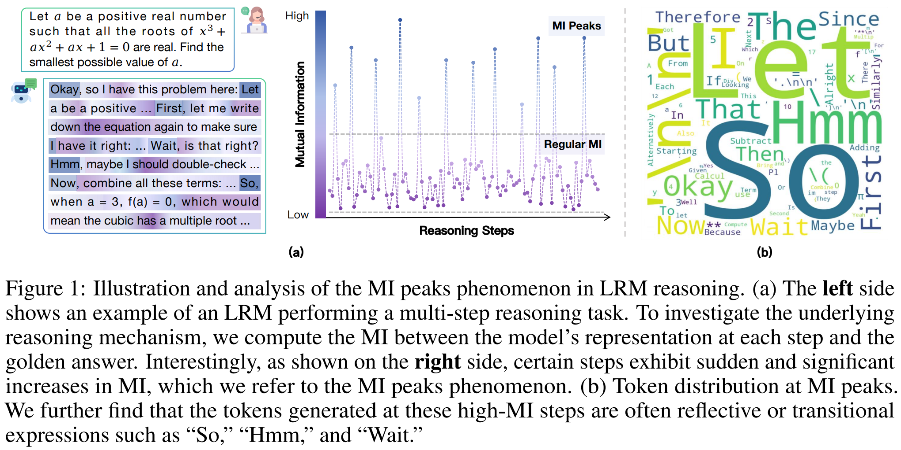
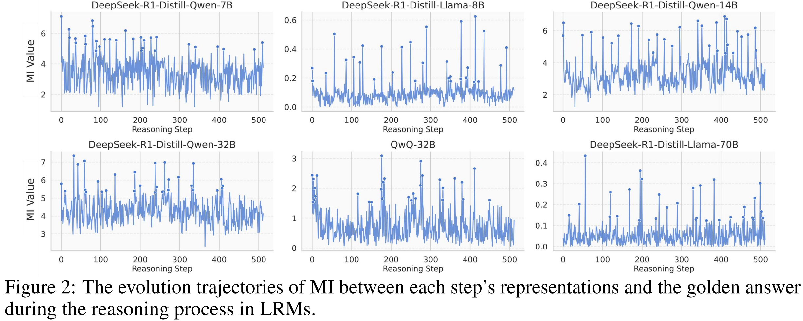
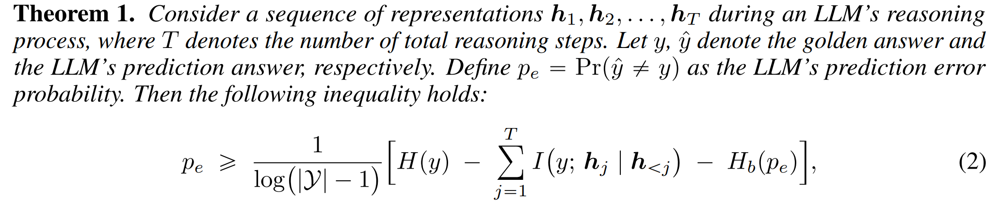
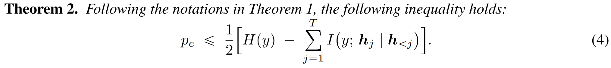
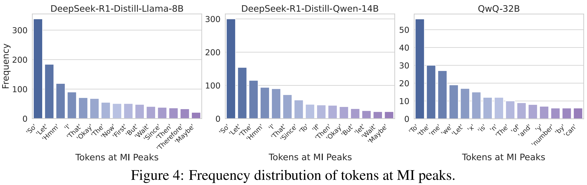

<!-- # DEAN: Deactivating the Coupled Neurons to Mitigate Fairness-Privacy Conflicts in Large Language Models -->

<div align="center">
  <h1>Demystifying Reasoning Dynamics with Mutual Information: Thinking Tokens are Information Peaks in LLM Reasoning</h1>
  <br />
  <span style="color:red">📢 <strong><i>If you are interested in our work, please star ⭐ our project.</i></strong></span>

  <h4>
    <a href="https://arxiv.org/abs/2506.02867"></a>
    
    
  </h4>
</div>


## 🌈 Introduction




Large reasoning models (LRMs) have demonstrated impressive capabilities in
complex problem-solving, yet their internal reasoning mechanisms remain poorly
understood. In this paper, we investigate the reasoning trajectories of LRMs from
an information-theoretic perspective. By tracking how mutual information (MI)
between intermediate representations and the correct answer evolves during LRM
reasoning, we observe an interesting *MI peaks* phenomenon: **the MI at specific
generative steps exhibits a sudden and significant increase during LRM’s
reasoning process**. We theoretically analyze such phenomenon and show that as
MI increases, the probability of model’s prediction error decreases. Furthermore,
**these MI peaks often correspond to tokens expressing reflection or transition, such as “Hmm”, “Wait” and “Therefore,”** which we term as the thinking
tokens. We then demonstrate that these thinking tokens are crucial for LRM’s
reasoning performance, while other tokens has minimal impacts. Building on
these analyses, we propose two simple yet effective methods to improve LRM’s
reasoning performance, by delicately leveraging these thinking tokens. Overall, our work provides novel insights into the reasoning mechanisms of LRMs and offers
practical ways to improve their reasoning capabilities.


##  🚩Main Analyses

<!-- <p style="color: #0288D1; font-size: 18px; font-weight: bold;">
    Certain steps exhibit sudden and significantly increases in MI during the reasoning process of LRMs, and these MI peaks are sparse and distribute non-uniformly.
</p> -->

**Certain steps exhibit sudden and significantly increases in MI during the reasoning process of LRMs, and these MI peaks are sparse and distribute non-uniformly.**




---

<!-- <p style="color: #0288D1; font-size: 18px; font-weight: bold;">
    DEAN remains robust even when only malicious fine-tuning data is available.
</p> -->

**Theoretical Insights: Higher MI Leads to Tighter Bounds on Prediction Error.**






**Non-reasoning LLMs exhibit weaker and less pronounced MI peaks compared to LRMs. And the overall MI in non-reasoning LLMs during the reasoning process is lower than their
corresponding LRMs.**


<!--  -->


**The tokens that appear at MI peaks are mostly connective words that express self-reflection or
transitions in LRM’s reasoning process.**




## 🚀Quick Start


### 🔧Requirements

The following pakages are required to run the code:

- python==3.11.5

- pytorch==2.1.2

- transformers==4.46.1

- numpy==1.26.4

### 🌟Usage

```bash
cd src/
```

**1. Collect the representations and compute the MI**

```bash
sh scripts/compute_mi_trajectories.sh
```

**2. Plot figures to observe the MI Peaks phenomenon**

```bash
run the plot_mi_peaks.ipynb
```


**3. Run the Representation Recycling (RR)**

```bash
sh scripts/run_RR.sh
```

## 📝License
Distributed under the Apache-2.0 License. See LICENSE for more information.


## Acknowledgements

Some code in this project is adapted from resources provided by the following repositories:

- https://github.com/QwenLM/Qwen2.5-Math
- https://github.com/ChnQ/TracingLLM

We greatly appreciate the contributions of the original authors.

## 📖BibTeX
```
@article{qian2025demystifying,
  title={Demystifying Reasoning Dynamics with Mutual Information: Thinking Tokens are Information Peaks in LLM Reasoning},
  author={Qian, Chen and Liu, Dongrui and Wen, Haochen and Bai, Zhen and Liu, Yong and Shao, Jing},
  journal={arXiv preprint arXiv:2506.02867},
  year={2025}
}